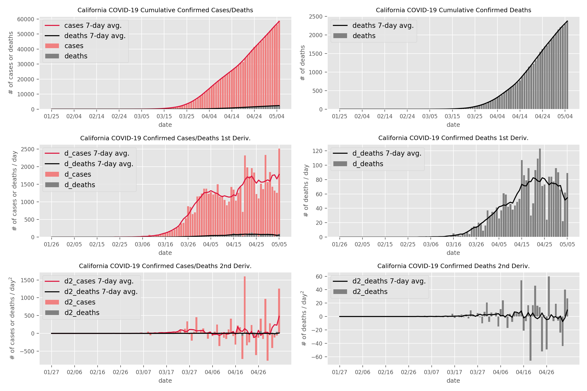

# COVID-19 Plotter

### Written by Isa Milefchik

	usage: plot_nyt.py [-h] --state STATE [--county COUNTY]
	
	Plot NYT COVID-19 data
	
	optional arguments:
	  -h, --help       show this help message and exit
	  --state STATE
	  --county COUNTY

